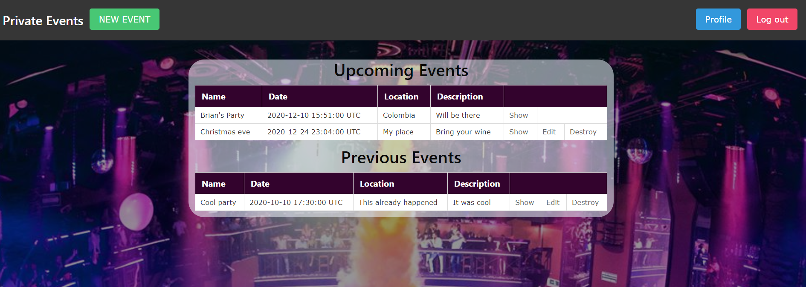
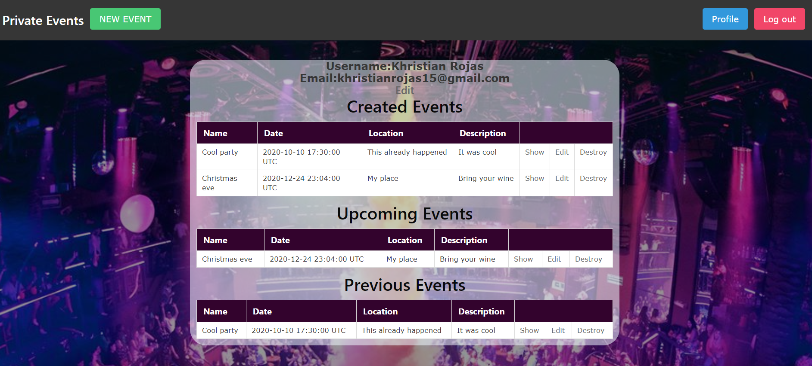

# Private Events

> Made as a practice for association in rails. It allows you to create events, edit them, invite and uninvite other users. You only can see the New Event button if you are logged in.

## Built With

- Ruby
- Ruby on rails
- Capybara / Rspec

## Pre-requisites

- Ruby 2.7.0
- Rails gem
- Bundle

## How it works

- Clone the repository locally from [here](git@github.com:karmaester/Private-Events.git)
- Open re-former folder and run `Bundle install`
- Run `rails db:migrate`
- Run `rails server`
- Open your browser
- Type `http://localhost:3000/`

## How edit works

- Sign up
- Click on new Event
- Start inviting your friends

## How to test it

Use the following commands
`rspec spec/features/user_registration_spec.rb`
`rspec spec/features/attendance_spec.rb`
`rspec spec/features/user_spec.rb`
`rspec spec/features/event_spec.rb`

## Authors

👤 **Khristian Rojas**

- Github: [@githubhandle](https://github.com/karmaester)
- Twitter: [@twitterhandle](https://twitter.com/karmaendlich)
- Linkedin: [linkedin](https://www.linkedin.com/in/khristian-rojas/)

👤 **Brian Cruz**

- Github: [@githubhandle](https://github.com/BrianSammit)
- Twitter: [@twitterhandle](https://twitter.com/cruzsammit)
- Linkedin: [linkedin](https://www.linkedin.com/in/brian-sammit-cruz-rodriguez-5877551a8/)

## 🤝 Contributing

Contributions, issues and feature requests are welcome!

Feel free to check the [issues page](https://github.com/karmaester/Private-Events/issues).

## Show your support

Give a ⭐️ if you like this project!

## Acknowledgments

- The Odin Project
- Rails guides
- Microverse

## 📝 License

This project is [MIT](lic.url) licensed.![]
